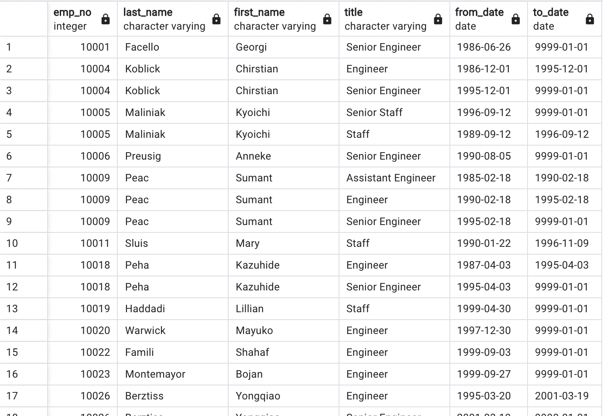
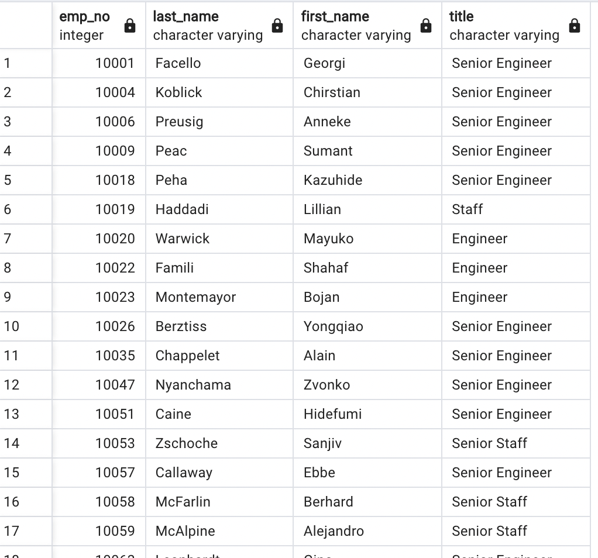

# Pewlett-Hackard-Analysis 
## Overview of the Analysis  
The purpose of the analysis is to filter out the employees who are eligible for retirement. 
## Results 
1. The first deliverable had the information on employees who are now ready for retirement listed by their most recent job title. As you can see there are many employees who are eligible.  

 
 
2. The second part of deliverable one consisted of filtering the data that contains the most recent title of each employee. 
 
  
 
3. The third part of the deliverable consists of titles of employees who are now eligible to retire. This will now help HR place job advertisements for the employees who are eligible to reitre.  
 
 

4. The second deliverable reflects employees who are eligible (born between January 1, 1965 and December 31, 1965 )
mentoring the potential new hire employees. As you can see within the csv file there very many options.  
 
 

## Summary  
The amount of roles that will need to be filled as the "silver tsunami" takes place are quite a few. We are looking at total  90398 for just this company. It will defitnetly take a while to replace all those individuals especially if they all retire within a close time period. The query I used was:  
 
SELECT DISTINCT ON (emp_no) emp_no 

FROM retirement_titles   
 
ORDER BY emp_no asc 

There are defitnetly not enough mentorship available employees to train the new employees coming in. The total amount of mentors available are 1549. The query I used was :  

SELECT DISTINCT ON (emp_no) emp_no  

FROM mentorship_eligibilty 

ORDER BY emp_no ASC

